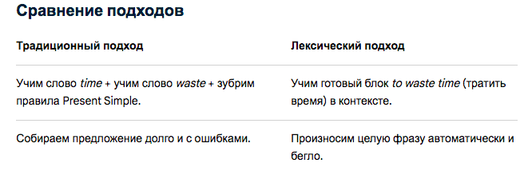

# Исходные данные по методам

- **Источник:** https://docs.google.com/document/d/1iZ0ReGeQ4PF1D1GRRJNkPK_scA5kzhcd0eXODbBeNUc/edit?usp=sharing
- **Дата выгрузки:** 2026-08-20
- **Форма:** дословная выгрузка документа «как есть». Порядок разделов, формулировки, авторские комментарии и опечатки оригинала сохранены без правок; уровни заголовков соответствуют уровням исходного документа. Встроенное в документ изображение сохранено рядом как `methodsfromanna_img1.png` и продублировано текстовой расшифровкой на своём месте.

---

## 🚩 Коммуникативная методика

Коммуникативная методика — это подход к обучению английскому языку, главной целью которого является развитие навыков живого общения и преодоление языкового барьера. Ученики начинают говорить на иностранном языке с самого первого занятия, используя слова и конструкции в реальном контексте, а не заучивая сухие грамматические правила наизусть.

### Главные принципы методики

- **Говорение с первого урока:** Ученик сразу включается в диалог, а не ждет, пока накопит словарный запас.
- **Отказ от рутинного перевода:** Значения слов объясняются через контекст, картинки, синонимы и жесты, что учит думать на английском.
- **Использование живых материалов:** В ход идут аудиозаписи, видеоролики, статьи из современных СМИ и блоги.
- **Практика превыше теории:** Грамматика изучается не ради тестов, а для того, чтобы правильно передать мысль в разговоре.

### Как проходит стандартный урок

- **Разминка (Warm-up):** Короткий диалог о делах и новостях для погружения в языковую среду.
- **Презентация темы:** Введение новой лексики или правила на живых примерах без долгих лекций.
- **Практика (Practice):** Ролевые игры, парная работа, обсуждение ситуаций из реальной жизни.
- **Свободная речь (Production):** Самостоятельное решение коммуникативной задачи (например, составить план или отстоять свою точку зрения).

Также есть другая схема урока, с другими названиями, но принцип одинаковый: **engagement (вовлечение), study (изучение) и activation (активация — использование)**. На стадии engagement педагог вовлекает ученика в процесс обучения: инициирует увлекательную дискуссию, предлагает обсудить картинку и т. п. На стадии изучения студенту поясняют грамматическую тему и использование новых слов и выражений, то есть работают над расширением словарного запаса и овладением грамматикой. На стадии активации знаний ученик выполняет различные упражнения для закрепления новой грамматики и слов. Это может быть продолжение обсуждения изучаемой темы, но уже с применением полученных знаний.

### Достоинства

- **Быстрое преодоление барьера:** Ученик начинает говорить с первых занятий и перестает бояться совершить ошибку.
- **Практическая польза:** Лексика и грамматика учатся сразу в контексте реальных диалогов и жизненных ситуаций, а не по абстрактным таблицам.
- **Развитие языковой интуиции:** Благодаря постоянной практике человек начинает «чувствовать» язык и правильно строить фразы на автомате.
- **Живой интерес:** Уроки проходят в формате дискуссий, ролевых игр и парной работы, что удерживает высокую мотивацию.

### Недостатки

- **Пробелы в системной грамматике:** Из-за упора на беглость речи правила могут усваиваться поверхностно, что ведет к устойчивым грамматическим ошибкам.
- **Стресс для новичков:** Полный отказ от родного языка на уроке (*Immersion*) может вызывать сильный дискомфорт у неподготовленных или абсолютных начинающих.
- **Зависимость от преподавателя:** Эффективность полностью зависит от профессионализма педагога, который должен грамотно балансировать между разговорной практикой и исправлением ошибок.
- **Медленный прогресс в академических навыках:** Письмо и сложный академический перевод развиваются дольше, так как фокус смещен на устную речь.

**Решения недостатков:** уделять больше внимания отработке грамматики через тренировочные упражнения, допускать разумное использование родного языка, ориентируясь на потребности учащихся, соблюдая баланс. При необходимости уделять больше внимания академическому письму.

**Почему подходит для формата приложения для взрослых**: это идеальный вариант для имитации реального репетитора, так как в отличие от простых приложений с карточками, где заучиваются слова без их устного использования в речи, здесь мы можем воссоздать этап production с AI-аватаром как на реальном занятии, где ученик будет говорить, а AI-аватар оценивать его речь и выдавать feedback. Это особенно подходит для стеснительных студентов, которые боятся совершить ошибку. Если соблюсти все предыдущие этапы, то знания усвоятся лучше.

Почему подходит для формата приложения для детей: Детям еще эффективнее изучать материал через общение, а общение с AI-аватаром будет стимулировать их любопытство.

---

## 🚩 Грамматико-переводной метод

Грамматико-переводной метод — это классический способ обучения языкам через заучивание грамматических правил и перевод текстов с родного языка на иностранный и обратно. Он делает упор на чтение и письмо, а разговорной речи и слуху уделяет мало внимания.

### Главные черты метода

- Правила объясняют на родном языке.
- Ученики учат правила наизусть и применяют их в упражнениях.
- Новые слова учат по спискам из текстов с помощью двуязычных словарей.
- Главная цель — научиться читать литературу и понимать структуру языка, а не говорить на нем.

### Достоинства

- **Глубокая база**: Ученик отлично понимает устройство языка, логику построения фраз и правила.
- **Навык чтения**: Метод позволяет быстро научиться читать и переводить сложные профессиональные или литературные тексты.
- **Развитие мышления**: Обучение задействует логику, анализ и тренирует память через заучивание правил и слов.
- **Простота организации**: Уроками легко управлять в больших группах, для них не нужны аудиоматериалы или носители языка.

### Недостатки

- **Языковой барьер**: Ученики не умеют говорить и с трудом понимают устную речь на слух.
- **Медленная реакция**: В живом диалоге человек тратит слишком много времени на мысленный перевод и подбор правил.
- **Скука и пассивность**: Заучивание сухих таблиц и списков слов отбивает интерес к языку.
- **Оторванность от жизни**: Используются искусственные тексты, в которых правила важнее реального смысла и контекста общения.

Важно! **Большинство приложений основаны на этот методике**, потому что с его помощью проще выстроить курс (Например, Дуолинго). Не требуется проверка устной речи, как в коммуникативке, можно учиться самому по ответам. Если мы хотим использовать цифровые аватары и ИИ в приложении, то как раз таки мы можем осуществить этот переход от классической, но ограничивающей грамматико-переводной методики, в сторону коммуникативной или иной другой, где подразумевается упор на устную речь.

Однако, ничего не мешает нам использовать переводные упражнения на этапе practice, такие упражнения знакомы многим и создают ощущение **безопасности и предсказуемости**, особенно у более старшего поколения, обучавшегося по грамматико-переводной методике в школе.

---

## 🚩 Аудиолингвальный метод

Аудиолингвальный метод — это способ обучения иностранному языку через многократное прослушивание и повторение фраз за диктором или учителем. Главная цель — довести построение предложений до автоматизма, чтобы человек мог говорить и понимать речь на слух без долгих раздумий.

### Главные черты метода

- **Опора на слух:** Сначала ученики учатся слышать и произносить звуки, а чтение и письмо появляются позже.
- **Правило привычки:** Язык считают набором поведенческих привычек, которые закрепляются через постоянные повторения (дрилл-упражнения).
- **Отказ от перевода:** Грамматику не заучивают через правила, а впитывают через готовые речевые образцы и диалоги.

### Достоинства метода

- Отличный слух: учащиеся хорошо понимают иностранную речь на слух в нормальном темпе.
- Чистое произношение: за счет постоянного повторения за диктором уходит акцент.
- Быстрый автоматизм: фразы и базовые структуры отлетают от зубов без долгих раздумий.
- Полезен для новичков: помогает легко преодолеть страх первого говорения.

### Недостатки метода

- Механическое заучивание: ученики часто повторяют слова без глубокого понимания смысла.
- Мало творчества: трудно сказать что-то свое, чего не было в готовых шаблонах.
- Игнорирование грамматики: правила почти не объясняются или даются слишком поздно.
- Проблемы с реальным общением: в живом диалоге заученные фразы могут не подойти под новую ситуацию

Этот метод также часто используется в языковых приложениях, я бы сказала, Дуолинго - это **микс грамматико-переводной и аудиолингвальной-методики,** но, как уже становится понятно, без этапа production. Потому что задания типа переведи предложения или повтори за диктором - не production! Production - это свой свободный ответ, продуманный или же спонтанный, не важно, главное - на основе выученного. Но этот метод можно также использовать на этапе practice. Такой микс трех методик, на мой взгляд идеален. Это то, что называется **principled eclecticism**, или осознанное смешивание.

---

## Task-Based Learning

**Task-Based Learning (TBL)** — это метод обучения иностранным языкам, где упор делается на выполнение практических жизненных задач (например, забронировать отель, составить план поездки или провести опрос). Язык здесь служит средством достижения цели, а не просто объектом для заучивания правил.

### Этапы урока TBL

**Pre-task (Подготовка):** Учитель вводит тему, погружает в контекст ситуации и объясняет суть задания. Здесь же может показать пример выполнения или напомнить нужные слова, но без долгого заучивания.

**Task Cycle (Выполнение задачи):**

- *Task:* Ученики работают в парах или группах и делают задание (например, договариваются о встрече, ищут выход из проблемы, делают постер по теме My house). Учитель только наблюдает и помогает.
- *Planning:* Ученики готовятся отчитаться о результатах, проверяют свои записи, думают, как лучше представить итог.
- *Report:* Ученики рассказывают классу или партнеру, что у них получилось. Учитель не перебивает за ошибки, важен сам результат общения.

**Language Focus (Анализ и работа с языком):**

- *Analysis:* Учитель разбирает то, как ученики говорили, выписывает удачные фразы и типичные ошибки.
- *Practice:* Точечная отработка правил или слов, которые вызвали трудности во время общения.

### Пример урока (Уровень: Pre-Intermediate / B1, Тема: «Планирование поездки»)

- **Pre-task (5–7 минут):** Учитель показывает картинки разных городов и спрашивает учеников, куда бы они хотели поехать на выходные и почему.
- **Task (15 минут):** Ученики делятся на пары. Каждая пара получает карточку с ограниченным бюджетом (например, 10 000 рублей) и ценами на билеты, отели и кафе. Задача — составить совместный план поездки на выходные, уложившись в сумму.
- **Planning & Report (10 минут):** Пары готовят короткое выступление: «Мы решили ехать в Казань на поезде, потому что...». Затем рассказывают свой план остальным.

**Language Focus (Анализ и работа с языком):**

- *Analysis:* Учитель разбирает то, как ученики говорили, выписывает удачные фразы и типичные ошибки.
- *Practice:* Точечная отработка правил или слов, которые вызвали трудности во время общения.

### Достоинства TBL

- **Быстрое преодоление страха речи:** студенты сразу начинают говорить и применять язык на практике.
- **Высокая мотивация:** решать интересные жизненные задачи увлекательнее, чем делать скучные упражнения.
- **Естественное усвоение:** грамматика и слова запоминаются в реальном контексте общения.
- **Развитие мышления:** ученики учатся искать информацию, договариваться и работать в команде.

### Недостатки TBL

- **Сложность для новичков:** людям с нулевым запасом слов очень трудно сразу выполнять задания без опоры на правила.
- **Риск заучить ошибки:** в процессе живого спонтанного разговора студенты могут использовать знакомые, но неверные конструкции, и не всегда их исправляют.
- **Хаотичность:** урок сложнее контролировать, результаты общения бывают непредсказуемыми.
- **Не подходит для всей грамматики:** некоторые сложные системные правила трудно объяснить «на лету» только через задачи.

Данный подход возможен, на мой взгляд, разово, как проект в конце Юнита. Для всего курса его сложно продумать, ведь по сути этапы идут как бы наоборот, сначала production, а затем уже разбор грамматики или лексики. Это все же проектная методика. Для детей такой формат будет интереснее.

---

## Total Physical Response

**Total Physical Response (TPR)** — это метод полного физического реагирования, который используют при обучении иностранным языкам. Его суть заключается в изучении слов и команд через движение и жесты. Метод копирует то, как дети учат родной язык, связывая услышанные фразы с физическими действиями.

### Основные принципы метода

- **Связь слова и действия**: Ученик не переводит слова в уме, а сразу выполняет физическое движение в ответ на команду учителя.
- **Природный подход**: Сначала идет период пассивного восприятия на слух, а когда ребенок или взрослый готов, он начинает говорить сам.
- **Снижение стресса**: Занятия проходят в игровой и динамичной форме, что помогает убрать страх ошибки.

### Как это работает на практике

- Учитель произносит команду на иностранном языке (например, *«Stand up»*, *«Sit down»*, *«Touch your nose»*) и показывает ее движениями.
- Ученики повторяют движение за учителем, а затем выполняют команду самостоятельно.
- Постепенно команды усложняются, а грамматика усваивается на интуитивном уровне без заучивания правил.

### Достоинства метода TPR

- **Быстрое запоминание:** Связь речи и движения помогает надежно усваивать лексику без зубрежки.
- **Снижение стресса:** Ученики не боятся делать ошибки, уходит языковой барьер и стеснение.
- **Естественный подход:** Имитирует то, как дети учат родной язык (через реакцию на действия взрослых).
- **Высокая мотивация:** Занятия проходят в игровой форме, удерживают внимание и служат разминкой.
- **Беспереводное понимание:** Слова связываются напрямую с образом или действием, а не с переводом на родной язык.

### Недостатки метода TPR

- **Ограниченность материала:** Трудно объяснять абстрактные понятия, сложные грамматические правила или времена с помощью жестов.
- **Только для начальных этапов:** Метод эффективен в самом начале обучения, но не может быть единственным инструментом для продвинутых уровней.
- **Физическая усталость:** Избыток активных движений утомляет учащихся и учителя.
- **Не подходит всем:** Аудиалам или людям с физическими ограничениями бывает сложнее воспринимать информацию только через движение.

Метод больше подходит для детей, если рассматривать урок для взрослых, то это в основном какие-то глаголы движения, либо эмоции, но не сложные абстрактные понятия. Также подходит в качестве разминки, например, задания true/false, можно попросить встать на ответе true и сесть на ответе false.

На этом подходе сложно выстроить целый учебный курс.

---

## Лексический подход

Лексический подход (Lexical Approach) в обучении иностранным языкам фокусируется на изучении готовых речевых блоков, устойчивых выражений и коллокаций (lexical chunks) вместо заучивания отдельных слов и абстрактных грамматических правил. Язык учится не через сборку предложения по правилам, а через использование целых смысловых кусков.

Пример:

### Примеры лексических блоков (чанков)

Вместо того чтобы учить слово *job* отдельно и правило построения времени отдельно, подход предлагает запоминать готовые сочетания:

**Collocations (словосочетания):** *apply for a job* (подать заявление на работу), *heavy rain* (сильный дождь) — мы не говорим *strong rain*, хотя по смыслу понятно.

**Fixed expressions (устойчивые фразы):** *It’s up to you* (тебе решать), *As far as I know* (насколько мне известно).

**Sentence builders (готовые каркасы):** *I’d like to...* (я бы хотел...).

*Расшифровка изображения из документа:*

**Сравнение подходов**

| Традиционный подход | Лексический подход |
| --- | --- |
| Учим слово *time* + учим слово *waste* + зубрим правила Present Simple. | Учим готовый блок *to waste time* (тратить время) в контексте. |
| Собираем предложение долго и с ошибками. | Произносим целую фразу автоматически и бегло. |

### Достоинства

- **Быстрая беглость:** Речь звучит естественно, так как не нужно тратить время на сборку предложения из отдельных слов.
- **Меньше языкового барьера:** Готовые шаблоны снижают страх сделать ошибку в грамматике.
- **Естественное усвоение:** Язык запоминается так же, как и родной — целыми фразами в контексте.
- **Практичность:** Фразы можно сразу использовать в реальном общении.

### Недостатки

- **Недостаток грамматической базы:** Без системного объяснения правил может возникнуть пробел в понимании сложных конструкций.
- **Сложность для экзаменов:** Подход хуже подходит для формальных тестов, где требуют четкого знания академической грамматики.
- **Требования к материалам:** Обычные учебники мало подходят, нужны специальные корпусные тексты и аутентичные примеры.
- **Иллюзия хаоса:** Ученикам иногда кажется, что на уроке просто идет беседа, а не системное обучение.

Не думаю, что стоит выстраивать приложение по этому подходу, так как самая огромная сложность - набрать материал. Материал каждого юнита отбирается по определенной теме, например, **еда**, значит, нужно набрать разных словосочетаний по этой теме, в том числе, в одном юните может быть как настоящее, так и прошедшее время, которое не будет объясняться отдельно. Например, I usually have lunch at 6.+Yesterday I had soup for lunch. -  Все дается готовой структурой, без отдельного объяснения времен.

Данный подход можно использовать изолированно, просто как набор словосочетаний в рамках одного юнита. Либо на высоких уровнях, где все правила грамматики уже знакомы.

---

## Прямой метод

Прямой метод обучения иностранным языкам — это подход, основанный на прямом связывании иностранного слова с понятием без использования родного языка. Ученики полностью погружаются в языковую среду, исключая перевод, зубрежку и опору на родной язык, подражая тому, как дети учат родную речь.

Весь процесс обучения по этому методу сводится к тому, чтобы создать атмосферу иностранного языка. Урок превращается в театральное представление, где каждый ученик играет свою роль, а педагог становится режиссером и драматургом. Обсуждаются картины, читаются пьесы, в лицах разыгрываются литературные произведения. Педагог, жестикулируя и играя, рассказывает случаи из жизни, путешествия, приключения. Комната, в которой происходит урок, наполнена предметами, отражающими жизнь, культуру и быт народа страны изучаемого языка: картинами, книгами, образцами искусства. Значение слов раскрывается сперва средствами наглядности (показ картин, предметов, действий), позднее – путем привлечения синонимов, антонимов, дефиниций, комментариев на иностранном языке, помещения слова в разные контексты.

### Главные принципы

- Полный отказ от родного языка и перевода на уроках.
- Связь слов с предметами через жесты, мимику, картинки и действия.
- Главный упор на устную речь (говорение и слух).
- Изучение грамматики через живые примеры и практику, а не через сухие правила.

### Плюсы и минусы

- **Плюсы:** Быстро уходит страх говорить, улучшается произношение, развивается языковая интуиция.
- **Минусы:** Сложнее объяснить абстрактные понятия без перевода, не хватает времени на глубокое изучение письменной грамматики.

На мой взгляд, это тоже слишком сложно для полного курса в приложении, этот метод действительно требует живого преподавателя. Коммуникативная методика частично опирается на этот принцип беспереводной презентации материала.
